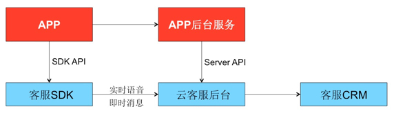

# 网梭APP客服 - 二次开发接口
=======
### 什么是 “网梭APP客服”
网梭公司（Onesoul）是**云客服**的专业服务提供商。

网梭云客服包括：

* APP客服
* WEB客服
* 微信客服
* 传统呼叫中心客服

其中 **APP客服** 是指：用户在移动APP中发起请求，完成与客服人员的会话沟通。

网梭APP客服功能包括以下两大功能：

* 实时语音通话
* IM即时消息会话

为了让第三方APP快速集成网梭APP客服功能，网梭提供了二次开发接口SDK。本文档为第三方APP开发商描述APP客服接口的概貌。

### 网梭APP客服SDK集成概貌图
   

### 二次开发接口
1. 服务端接口
2. [iOS客户端接口](网梭APP客服-iOS客户端二次开发接口.md)
3. Android客户端接口

